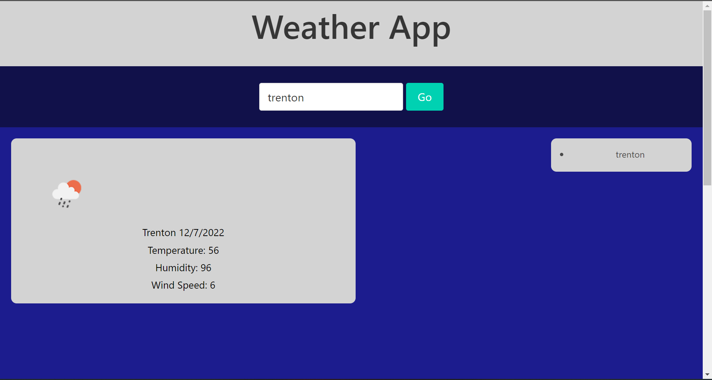

# weather-app

in this app i created an interface to check the weather in your local area. to use the app, you type your city name in the search bar, and click the go button. i used the openweather API to makethe call to recieve weather data.

## todo:
- include 5 day forecast
- make search history clickable to retrieve past search data
- debug weather icon

github repo: https://github.com/JaredIng87/weather-app
deployed link: https://jareding87.github.io/weather-app/

